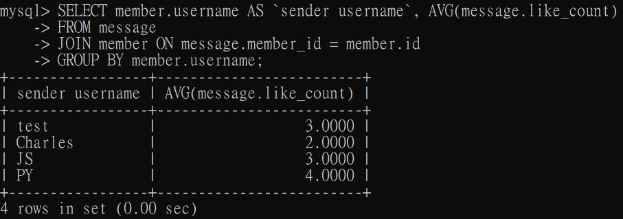

# Task 2: Create database and table in your MySQL server
### ●	Create a new database named website.

### ●	Create a new table named member, in the website database, designed as below:

# Task 3: SQL CRUD
### ●	INSERT a new row to the member table where name, username and password must be set to test. INSERT additional 4 rows with arbitrary data.

### ●	SELECT all rows from the member table.

### ●	SELECT all rows from the member table, in descending order of time.

### ●	SELECT total 3 rows, second to fourth, from the member table, in descending order of time. Note: it does not mean SELECT rows where id are 2, 3, or 4.

### ●	SELECT rows where username equals to test.

### ●	SELECT rows where name includes the es keyword.

### ●	SELECT rows where both username and password equal to test.

### ●	UPDATE data in name column to test2 where username equals to test.

# Task 4: SQL Aggregation Functions
### ●	SELECT how many rows from the member table.

### ●	SELECT the sum of follower_count of all the rows from the member table.

### ●	SELECT the average of follower_count of all the rows from the member table.

### ●	SELECT the average of follower_count of the first 2 rows, in descending order of follower_count, from the member table.

# Task 5: SQL JOIN
### ●	Create a new table named message, in the website database. designed as below:

### 補充：為message table建立五筆測資 
INSERT 5 rows with assigned and arbitrary data to message table.

### ●	SELECT all messages, including sender names. We have to JOIN the member table to get that.

### ●	SELECT all messages, including sender names, where sender username equals to test. We have to JOIN the member table to filter and get that.

### ●	Use SELECT, SQL Aggregation Functions with JOIN statement, get the average like count of messages where sender username equals to test.

### ●	Use SELECT, SQL Aggregation Functions with JOIN statement, get the average like count of messages GROUP BY sender username.

